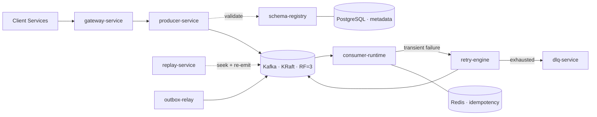

<div align="center">

# Kafka Event Streaming Platform

**A production-grade internal event platform** — reliable publish/consume, schema governance,
non-blocking retries, dead-letter queues, replay, idempotency and full observability.

[](https://github.com/aakashporwal1602/kafka-event-platform/actions/workflows/ci.yml)
[](https://nodejs.org)
[](https://www.typescriptlang.org)
[](https://kafka.apache.org)
[](https://fastify.dev)
[](./LICENSE)

</div>

---

## What this is

Most "Kafka projects" are a producer, a consumer and a `console.log`. This is the thing a platform
team actually builds: the layer that lets forty product services publish and consume events **without
each of them reinventing retries, schema validation, dead-lettering and idempotency**.

Think of it as a simplified version of the internal event platforms at Uber, LinkedIn or Netflix.

> **Status:** Under active development, built chapter by chapter.
> **Progress: 1 / 18 chapters** — see [ROADMAP.md](./docs/ROADMAP.md).

---

## Why it exists

| Without a platform                                                                 | With this platform                                        |
| ---------------------------------------------------------------------------------- | --------------------------------------------------------- |
| A producer adds a required field; three consumers crash at 2am                     | Schema registry rejects the incompatible change **in CI** |
| A poison message blocks a partition; lag grows without bound                       | Tiered retry topics — **the partition never blocks**      |
| Un-processable events are logged and lost                                          | Dead-letter queue with full context and selective redrive |
| A bug corrupts a projection; someone writes a backfill script under pressure       | Replay by offset, timestamp, partition or key             |
| At-least-once delivery meets a non-idempotent handler; customers are charged twice | Redis dedup + idempotent sinks = **exactly-once effect**  |
| A stuck consumer is discovered via a customer complaint                            | Lag alerting with runbook links                           |

---

## Architecture



Full design: **[docs/hld/01-system-architecture.md](./docs/hld/01-system-architecture.md)**
Decisions and their trade-offs: **[docs/adr/](./docs/adr/README.md)**

---

## Capabilities

|     | Capability                                                                | Chapter |
| --- | ------------------------------------------------------------------------- | ------- |
| 📤  | Publish single and batch events via REST or SDK                           | 4–5     |
| 📋  | Avro schema registry with BACKWARD/FORWARD/FULL compatibility enforcement | 6       |
| 📥  | Consumer framework with backpressure and cooperative rebalancing          | 7       |
| 🔁  | Non-blocking tiered retries with exponential backoff and jitter           | 9       |
| ☠️  | Dead-letter queue with inspection API and selective redrive               | 9       |
| ⏪  | Replay by offset, timestamp, partition or key                             | 10      |
| 🔂  | Idempotency via Redis + idempotent sinks (exactly-once _effect_)          | 8       |
| 📦  | Transactional outbox and CDC integration                                  | 11      |
| 📊  | Prometheus metrics, Grafana dashboards, OpenTelemetry tracing             | 12      |
| 🔐  | JWT / API keys, RBAC, Kafka ACLs, per-tenant quotas                       | 13      |
| ⏰  | Delayed, scheduled and priority events; signed webhooks                   | 14      |

---

## Tech stack

**Runtime** Node.js 22 · TypeScript 5.6 (strict) · Fastify 5
**Messaging** Apache Kafka (KRaft) · KafkaJS · Avro
**State** PostgreSQL 16 · Redis 7
**Observability** Prometheus · Grafana · OpenTelemetry · Jaeger · Pino
**Delivery** Docker Compose · Kubernetes · GitHub Actions
**Testing** Vitest · Testcontainers · k6

---

## Quick start

> Requires Docker, Node 22+ and pnpm 9+.

```bash
git clone https://github.com/aakashporwal1602/kafka-event-platform.git
cd kafka-event-platform
pnpm install

pnpm infra:up          # Kafka (3 brokers), Postgres, Redis, Prometheus, Grafana, Jaeger
pnpm topics:bootstrap  # provision topics declaratively
pnpm dev               # start all services

pnpm verify            # format + lint + typecheck + test
```

| Service      | URL                        |
| ------------ | -------------------------- |
| Gateway API  | http://localhost:3000      |
| OpenAPI docs | http://localhost:3000/docs |
| Kafka UI     | http://localhost:8080      |
| Grafana      | http://localhost:3001      |
| Jaeger       | http://localhost:16686     |
| Prometheus   | http://localhost:9090      |

_Infrastructure lands in Chapter 1; these commands become live then._

---

## Repository layout

```
apps/          9 deployable services (gateway, producer, consumer-runtime, retry, dlq, replay, outbox, notification, dashboard)
packages/      5 shared libraries (core, kafka-client, observability, persistence, contracts)
infra/         docker-compose, Kubernetes manifests, Grafana dashboards, Prometheus rules
docs/          HLD, LLD, ADRs, runbooks, OpenAPI
tests/         integration (Testcontainers), contract, chaos, load (k6)
tools/         topic bootstrap, codegen, seed scripts
```

---

## Documentation

| Document                                                    | Contents                                                      |
| ----------------------------------------------------------- | ------------------------------------------------------------- |
| [System Architecture](./docs/hld/01-system-architecture.md) | Requirements, capacity model, all diagrams, failure matrix    |
| [ADRs](./docs/adr/README.md)                                | Eight decisions with alternatives rejected and costs accepted |
| [Roadmap](./docs/ROADMAP.md)                                | 18 chapters, dependency graph, requirement coverage           |
| [Contributing](./CONTRIBUTING.md)                           | Branch strategy, commit conventions, definition of done       |
| [Changelog](./CHANGELOG.md)                                 | Keep a Changelog, semantic versioning                         |

---

## Screenshots

_Placeholders — populated as each chapter lands._

|                                                           |                                                    |
| --------------------------------------------------------- | -------------------------------------------------- |
|  |  |
| Grafana — throughput, lag, retry tiers                    | Ops console — DLQ inspection and redrive           |

---

## Future improvements

Deliberately out of scope for v1.0, documented so the boundary is a decision rather than an omission:

- Multi-region active-active with MirrorMaker 2
- Kafka Streams / Flink integration for stateful processing
- Tiered storage (S3 offload for cold segments)
- Schema-driven SDK codegen for consumer teams
- Automated partition rebalancing under sustained hot-partition load

---

## License

MIT © [Aakash Porwal](https://github.com/aakashporwal1602)
