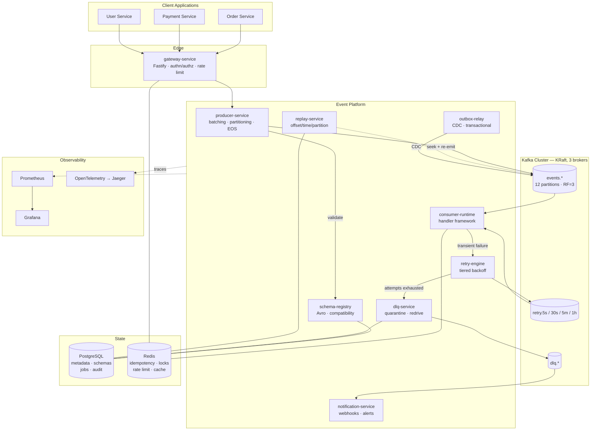
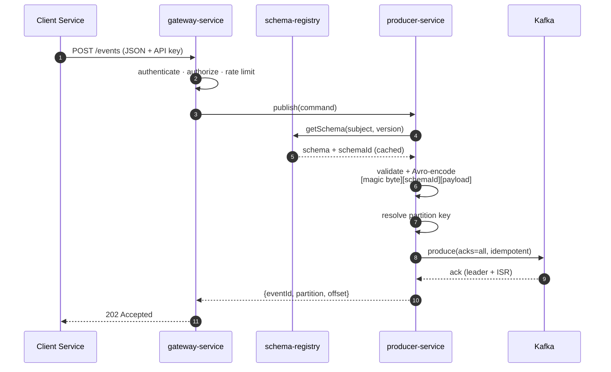
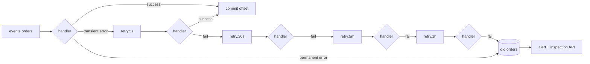
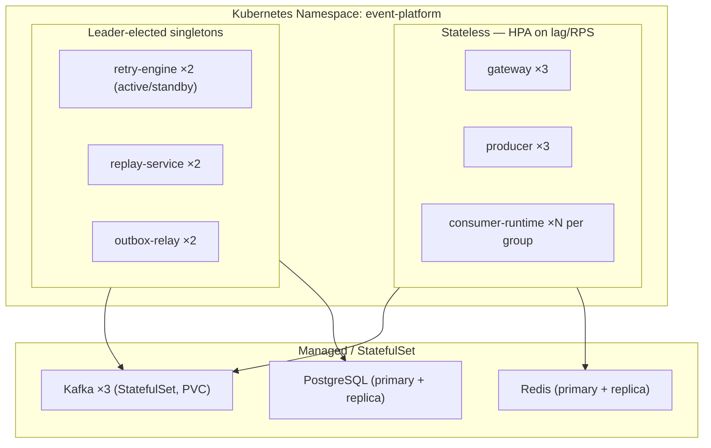

# System Architecture — High-Level Design

> **Status:** Baseline (Chapter 0) · **Version:** 0.1.0 · **Owner:** Platform Engineering

---

## 1. Problem statement

In an organisation with more than a handful of services, every team eventually needs to publish
domain events and have other teams react to them. Left ungoverned, this produces a predictable
set of failures:

| Failure                    | What it looks like in production                                                                                |
| -------------------------- | --------------------------------------------------------------------------------------------------------------- |
| **No schema contract**     | A producer adds a required field. Three downstream consumers crash at 2am. Nobody knows who owns the topic.     |
| **Naive retries**          | A consumer retries in-place on a poison message and blocks its partition indefinitely. Lag grows without bound. |
| **No DLQ**                 | Un-processable messages are logged and dropped. The data is gone and nobody notices for a week.                 |
| **No replay**              | A bug corrupted a projection. The only fix is a manual backfill script written under incident pressure.         |
| **Duplicate side effects** | At-least-once delivery meets a non-idempotent handler. Customers get charged twice.                             |
| **Invisible lag**          | The first signal of a stuck consumer is a customer complaint.                                                   |

**This platform exists to make the correct thing the easy thing.** A product team should be able to
publish an event with one HTTP call or one library call, and get schema validation, retries with
backoff, a dead-letter queue, replay capability, idempotency, tracing and lag alerting _by default_ —
without implementing any of it themselves.

---

## 2. Requirements

### 2.1 Functional

| ID   | Requirement                                                                  |
| ---- | ---------------------------------------------------------------------------- |
| F-1  | Publish a single event or a batch of events to a named topic via REST or SDK |
| F-2  | Register and evolve Avro schemas with enforced compatibility                 |
| F-3  | Reject events that do not conform to the registered schema                   |
| F-4  | Consume events with at-least-once delivery and exactly-once _effect_         |
| F-5  | Retry failed events with exponential backoff without blocking the partition  |
| F-6  | Route permanently-failed events to a dead-letter queue with full context     |
| F-7  | Inspect and selectively redrive DLQ events                                   |
| F-8  | Replay historical events by offset, timestamp, partition or key              |
| F-9  | Expose consumer lag, throughput, retry and DLQ metrics                       |
| F-10 | Authenticate and authorise producers/consumers per tenant                    |
| F-11 | Support delayed, scheduled and priority delivery                             |
| F-12 | Deliver events to external systems via signed webhooks                       |

### 2.2 Non-functional

| ID  | Requirement                  | Target                                                                         |
| --- | ---------------------------- | ------------------------------------------------------------------------------ |
| N-1 | Publish latency (p99)        | < 50 ms at the gateway                                                         |
| N-2 | Sustained throughput         | 10,000 events/sec baseline; architecture must scale to 5M/sec                  |
| N-3 | Durability                   | Zero acknowledged-then-lost events (`acks=all`, RF=3, `min.insync.replicas=2`) |
| N-4 | Availability                 | Publish path survives one broker loss with no data loss                        |
| N-5 | End-to-end delivery (p99)    | < 2 s under normal load                                                        |
| N-6 | Consumer lag alert threshold | > 60 s time-lag sustained for 5 min                                            |
| N-7 | Recovery                     | Any consumer group can be rewound and replayed without operator SSH access     |
| N-8 | Multi-tenancy                | One tenant cannot starve another (quotas + rate limits)                        |

### 2.3 Explicit non-goals

Stating these matters as much as the requirements — it shows the scope was **bounded deliberately**.

- **Not** a Kafka replacement or a broker implementation.
- **Not** a stream-processing engine (no windowing, joins, or aggregations — that is Flink/Kafka Streams).
- **Not** a multi-region active-active deployment (single-region; cross-region is discussed in Ch 17).
- **Not** a general message broker — this is _event streaming_, not request/reply RPC.
- **No** exactly-once delivery. We deliver at-least-once and make effects idempotent. (See ADR-008.)

---

## 3. Capacity model

Design targets are meaningless without arithmetic. Baseline sizing at **10,000 events/sec**:

```
Average event size (Avro, compressed)         ≈  1.2 KB
Ingress throughput          10,000 × 1.2 KB   ≈  12 MB/s
With RF=3 (replication)     12 × 3            ≈  36 MB/s cluster write
Daily volume                10,000 × 86,400   ≈  864 M events/day
Daily storage (pre-RF)      864M × 1.2 KB     ≈  1.04 TB/day
Retention 7 days, RF=3      1.04 TB × 7 × 3   ≈  21.8 TB
```

**Partition sizing.** Rule of thumb: one partition sustains ~10 MB/s write and a single consumer
instance handles ~1,000 events/sec for a non-trivial handler.

```
Throughput-bound partitions   12 MB/s ÷ 10 MB/s  →  2
Consumer-parallelism bound    10,000 ÷ 1,000     →  10
Headroom for 3× growth                           →  30
Chosen: 12 partitions per high-volume topic (see ADR note below)
```

We choose **12** rather than 30 because partitions are cheap to add but **impossible to remove**, and
each partition costs file handles, memory and rebalance time on every broker. Twelve divides evenly
by 1, 2, 3, 4, 6 and 12 consumer instances, which keeps partition assignment balanced at every
realistic scale-out step — an unevenly-divisible count means some consumers permanently do more work.

**Broker sizing.** 36 MB/s cluster write against 3 brokers ≈ 12 MB/s each — comfortably within a
single modern node. The binding constraint at this scale is **disk**, not CPU or network: 21.8 TB
across 3 brokers ≈ 7.3 TB per broker.

---

## 4. System architecture



---

## 5. Component responsibilities

| Service                  | Owns                                                                             | Does **not** own                                                  |
| ------------------------ | -------------------------------------------------------------------------------- | ----------------------------------------------------------------- |
| **gateway-service**      | HTTP surface, authn/authz, rate limiting, request validation, OpenAPI            | Kafka connections, business logic                                 |
| **producer-service**     | Serialization, partition assignment, batching, compression, transactional writes | HTTP, authorization                                               |
| **schema-registry**      | Schema storage, versioning, compatibility enforcement, ID assignment             | Event routing                                                     |
| **consumer-runtime**     | Consumer group lifecycle, offset commits, handler dispatch, backpressure         | What handlers actually do                                         |
| **retry-engine**         | Backoff scheduling, retry-tier routing, attempt tracking, retry budgets          | Deciding _whether_ an error is retryable (the handler classifies) |
| **dlq-service**          | Quarantine, context capture, inspection API, selective redrive                   | Automatic retry                                                   |
| **replay-service**       | Replay job lifecycle, offset resolution, throttled re-emission                   | Deduplication (consumers own idempotency)                         |
| **outbox-relay**         | Reading the outbox table / CDC stream, publishing atomically-written events      | Writing to the outbox (the app does that in its own transaction)  |
| **notification-service** | Webhook delivery, signing, alert fan-out                                         | Event storage                                                     |

**The rule that keeps this clean:** every service owns exactly one stage of the event lifecycle, and
no service reaches into another's datastore. Cross-service communication is Kafka or HTTP, never a
shared table.

---

## 6. The three paths

### 6.1 Publish path (happy)



The **202** rather than 201 is deliberate: we have accepted the event for durable delivery, but
downstream processing has not happened yet. Returning 201 would imply a completed resource creation.

### 6.2 Consume path with retry and DLQ



The critical property: **a failing message never blocks its partition.** The main consumer commits
the offset immediately after forwarding to a retry topic, so head-of-line blocking is impossible.
This is the tiered-retry-topic pattern (ADR-005), and it is how Uber's consumer platform works.

### 6.3 Failure path

Covered in depth in Chapter 9. Summary of what each failure degrades to:

| Failure              | Behaviour                                                                     |
| -------------------- | ----------------------------------------------------------------------------- |
| Broker down (1 of 3) | No impact — `min.insync.replicas=2` still satisfied                           |
| Broker down (2 of 3) | Publish fails fast with 503; no silent data loss                              |
| Consumer crash       | Group rebalances; uncommitted messages redelivered (at-least-once)            |
| Schema registry down | Producers serve from local schema cache; new schemas rejected                 |
| Redis down           | Idempotency degrades to at-least-once; **fail open**, do not block publishing |
| Postgres down        | Metadata reads served from cache; job creation rejected; publish unaffected   |
| Poison message       | Retried through tiers, then quarantined in DLQ with full context              |

**Design principle:** the publish path must survive the loss of every dependency except Kafka itself.

---

## 7. Technology choices at a glance

| Concern            | Choice                                    | Rejected alternatives          | ADR                                             |
| ------------------ | ----------------------------------------- | ------------------------------ | ----------------------------------------------- |
| Coordination       | Kafka **KRaft**                           | ZooKeeper                      | [001](../adr/0001-kafka-kraft-mode.md)          |
| HTTP framework     | **Fastify**                               | Express, NestJS                | [002](../adr/0002-fastify-over-express.md)      |
| Repo layout        | **pnpm monorepo** + TS project references | Polyrepo, Nx, Turborepo        | [003](../adr/0003-pnpm-monorepo.md)             |
| Kafka client       | **KafkaJS**                               | node-rdkafka, Confluent JS     | [004](../adr/0004-kafkajs-over-node-rdkafka.md) |
| Retry model        | **Tiered retry topics**                   | In-place retry, blocking retry | [005](../adr/0005-tiered-retry-topics.md)       |
| Serialization      | **Avro** + registry                       | JSON Schema, Protobuf          | [006](../adr/0006-avro-schema-registry.md)      |
| Write atomicity    | **Transactional outbox**                  | Dual write, 2PC                | [007](../adr/0007-transactional-outbox.md)      |
| Delivery semantics | At-least-once + **Redis idempotency**     | Kafka EOS as primary           | [008](../adr/0008-idempotency-strategy.md)      |

---

## 8. Deployment topology (target)



Consumer replicas are capped at the partition count — a 13th consumer in a 12-partition group sits
idle. That constraint is why partition count is a capacity decision, not a configuration detail.

---

## 9. What this design deliberately does not solve

Naming the limits is part of the design.

- **Global ordering.** We guarantee ordering _per partition key_, not across a topic. Global ordering
  requires a single partition, which caps throughput at one consumer.
- **Sub-millisecond latency.** Batching (`linger.ms`) trades latency for throughput. Applications
  needing < 5 ms should not use an event bus.
- **Cross-region replication.** Single-region. MirrorMaker 2 / uReplicator is discussed in Ch 17.
- **Very large payloads.** Events above ~1 MB should use the claim-check pattern (store in S3, publish
  a reference). The platform will reject oversized events rather than silently degrade.

---

## 10. References

- [ADR index](../adr/README.md)
- [Roadmap and progress tracker](../ROADMAP.md)
- Kafka: _The Definitive Guide_, 2nd ed. — Shapira, Palino, Sivaram, Petty
- _Designing Data-Intensive Applications_ — Kleppmann, ch. 11
