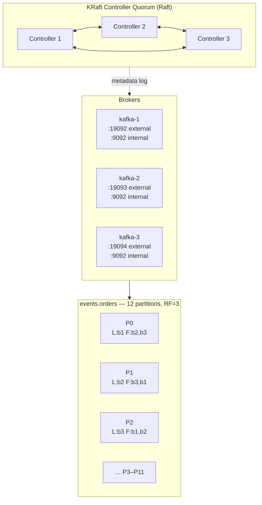
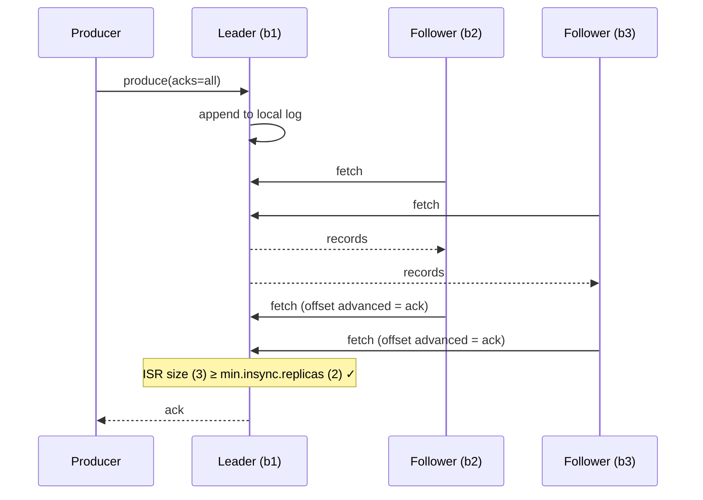

# Kafka Topology — Partitions, Replication and ISR

> **Status:** Baseline (Chapter 1) · Companion to [01-system-architecture.md](./01-system-architecture.md)

This document explains *why* the cluster is configured the way it is. Every setting in
`infra/docker/docker-compose.yml` and `tools/topics.config.ts` traces back to something here.

---

## 1. Cluster topology



In local development each node runs **both** roles (`process.roles=broker,controller`).
Production separates them: three dedicated controllers, N brokers. That divergence is deliberate and
documented in [ADR-0001](../adr/0001-kafka-kraft-mode.md).

---

## 2. Listeners — the thing that trips everyone up

Three listeners per broker, each with a different job:

| Listener | Port | Used by | Advertised as |
|---|---|---|---|
| `INTERNAL` | 9092 | Broker↔broker, and containers on `kep-network` | `kafka-N:9092` |
| `EXTERNAL` | 1909N | Your laptop, outside Docker | `localhost:1909N` |
| `CONTROLLER` | 9093 | Raft quorum only | — |

**Why two client listeners at all.** A Kafka client does not talk to whatever address you gave it. It
connects once for metadata, then Kafka replies with the **advertised** address of each partition
leader, and the client reconnects there. So if the broker advertises `kafka-1:9092`, a client on your
laptop resolves that hostname, fails, and you get the classic error where bootstrap works but
producing times out.

Two listeners, two advertised addresses, and both audiences get an address they can actually reach.

```
❌ one listener              ✅ two listeners
   advertise kafka-1:9092       INTERNAL → kafka-1:9092   (containers ✓)
   host cannot resolve          EXTERNAL → localhost:19092 (host ✓)
```

---

## 3. Partitions

A partition is the **unit of parallelism, ordering and storage** in Kafka. Three properties follow:

1. **Ordering is guaranteed within a partition, never across a topic.** Messages with the same key go
   to the same partition, so per-key ordering holds. Global ordering requires one partition, which
   caps you at one consumer.
2. **Consumer parallelism is capped by partition count.** In a group, one partition is assigned to
   exactly one consumer. Thirteen consumers on twelve partitions means one sits idle forever.
3. **Partition count can be increased but never decreased.** And increasing it changes the
   `hash(key) % partitions` mapping, so existing keys start landing in different partitions —
   breaking per-key ordering for in-flight data.

That last point is why partition count is a **capacity decision**, not a config tweak.

### Sizing (from HLD §3)

```
Throughput bound      12 MB/s ÷ ~10 MB/s per partition   →   2
Consumer parallelism  10,000/s ÷ ~1,000/s per consumer   →  10
3× growth headroom                                       →  30
Chosen                                                   →  12
```

**Why 12 and not 30.** Partitions are not free: each costs an open file handle, a memory buffer and
producer-side batching state on every broker, and every partition lengthens rebalance time. Twelve is
above both bounds with room to grow, and it divides evenly by 1, 2, 3, 4, 6 and 12 — so partition
assignment stays balanced at every realistic consumer count. A count like 10 means a 3-consumer group
splits 4/3/3, and one consumer permanently does 33% more work.

### Retry topics get fewer partitions

Retry volume is a small fraction of primary volume. `tools/topics.config.ts` gives retry tiers and the
DLQ `max(3, partitions/4)` — three partitions for a twelve-partition domain. Over-provisioning here
costs broker resources for throughput that will never arrive.

---

## 4. Replication and ISR

### The three sets

```
Replicas (AR)   [1, 2, 3]   every broker holding a copy
ISR             [1, 2, 3]   replicas caught up within replica.lag.time.max.ms (30s)
Leader          1           handles all reads and writes for this partition
```

A follower stays in the ISR by continuously fetching from the leader. Fall more than
`replica.lag.time.max.ms` behind — because the broker is slow, GC-paused, or network-partitioned — and
the leader **shrinks the ISR**, removing it.



Note the mechanism: followers **pull**, and the fetch request itself carries the follower's new offset,
which is how the leader knows it is caught up. There is no separate acknowledgement message.

### The three settings that must be reasoned about together

| Setting | Value | Meaning |
|---|---|---|
| `replication.factor` | 3 | Three copies exist |
| `min.insync.replicas` | 2 | At least two must be in sync for a write to be accepted |
| `acks` (producer) | `all` | Leader waits for all *in-sync* replicas before acknowledging |

**None of these works alone.** `acks=all` with `min.insync.replicas=1` is a trap: if the ISR has
shrunk to just the leader, `all` means "the leader", and a leader crash loses acknowledged data. The
guarantee comes from the combination.

```
RF=3 + minISR=2 + acks=all
   ├─ tolerates 1 broker down  → writes continue, no data loss
   └─ 2 brokers down           → writes REJECTED (NotEnoughReplicas)
                                  ...which is correct: fail loudly rather than
                                  accept a write that cannot survive.
```

### Failure walk-through

| Scenario | ISR | Behaviour |
|---|---|---|
| All healthy | `[1,2,3]` | Writes acknowledged after 3 replicas |
| Broker 3 slow (GC pause) | `[1,2]` | Writes continue — ISR 2 ≥ minISR 2 |
| Broker 3 down | `[1,2]` | Writes continue; b3 re-joins and catches up on restart |
| Brokers 2 and 3 down | `[1]` | **Writes rejected** with `NOT_ENOUGH_REPLICAS`. Reads still served |
| Leader b1 dies, ISR `[1,2,3]` | `[2,3]` | b2 or b3 promoted; **no data loss** — both were in sync |
| Leader b1 dies, ISR `[1]` | — | Partition offline. With `unclean.leader.election=false` we **wait** rather than promote a stale replica |

### Unclean leader election is off

`unclean.leader.election.enable=false` is set cluster-wide. If the only in-sync replica dies, the
partition becomes unavailable until it returns — Kafka will **not** promote an out-of-sync replica.

This is an explicit **availability-vs-durability** choice: we accept downtime rather than silent data
loss. For an event platform carrying payment events, that is the correct trade. A metrics pipeline
might reasonably choose the opposite.

---

## 5. Producer acknowledgement modes

| `acks` | Waits for | Durability | Throughput | Use |
|---|---|---|---|---|
| `0` | nothing | ✗ fire-and-forget | Highest | Metrics you can afford to lose |
| `1` | leader only | ⚠ lost if leader dies before replication | High | Logs, analytics |
| `all` | all in-sync replicas | ✓ survives leader loss | Lower | **Our default** |

The cost of `acks=all` is one extra network round trip, largely hidden by batching. For a platform
whose non-functional requirement N-3 is *zero acknowledged-then-lost events*, it is not optional.

---

## 6. Topic naming convention

```
<class>.<domain>[.<qualifier>]

events.orders            primary event stream
retry.orders.5s          retry tier
dlq.orders               dead letter queue
platform.schemas         platform-internal
```

A convention with a machine-checkable prefix means monitoring, ACLs and quotas can be applied by
pattern (`retry.*`, `dlq.*`) rather than being enumerated per topic. The alternative — `order-events`,
`orderRetryTopic`, `orders_dlq_final` — makes every one of those a manual list.

---

## 7. Retention

| Topic class | Retention | Rationale |
|---|---|---|
| `events.*` | 7 days | Long enough to replay a week of history; the dominant storage cost |
| `events.payments` | 30 days | Financial reconciliation needs a longer window |
| `retry.*` | 3 days | A message not resolved in 3 days is in the DLQ anyway |
| `dlq.*` | 30 days | Somebody investigates these — 7 days is not enough after a holiday weekend |
| `platform.schemas` | **infinite, compacted** | The current schema for every subject must exist forever |
| `platform.audit` | 90 days | Compliance |

**Compaction on `platform.schemas`** is the interesting one: `cleanup.policy=compact` keeps the *latest
value per key* forever and discards superseded versions. The topic becomes a durable key-value store —
which is exactly how Confluent Schema Registry stores its own state (Chapter 6).

---

## 8. Operational commands

```bash
# Cluster health
docker exec kep-kafka-1 /opt/kafka/bin/kafka-metadata-quorum.sh \
  --bootstrap-server localhost:9092 describe --status

# Under-replicated partitions — the single most important health check
docker exec kep-kafka-1 /opt/kafka/bin/kafka-topics.sh \
  --bootstrap-server localhost:9092 --describe --under-replicated-partitions

# Consumer group lag
docker exec kep-kafka-1 /opt/kafka/bin/kafka-consumer-groups.sh \
  --bootstrap-server localhost:9092 --describe --group <group-id>

# Rebalance partition leadership after a broker restart
docker exec kep-kafka-1 /opt/kafka/bin/kafka-leader-election.sh \
  --bootstrap-server localhost:9092 --election-type PREFERRED --all-topic-partitions
```

`--under-replicated-partitions` returning anything non-empty means durability guarantees are currently
weaker than configured. It should be zero at all times, and it is alerted on in Chapter 12.

---

## 9. Interview questions this configuration answers

<details>
<summary><b>Why 12 partitions?</b></summary>

Two bounds. Throughput: 12 MB/s ÷ ~10 MB/s per partition ≈ 2. Consumer parallelism: 10,000 events/sec
÷ ~1,000/sec per consumer instance = 10. Take the max, add headroom → 12. I chose 12 rather than 30
because partitions cost file handles, memory and rebalance time, and because 12 divides evenly by
1/2/3/4/6/12 so consumer assignment stays balanced at every scale-out step. Partitions can be added
later but never removed, and adding them changes the key→partition mapping — so it's a capacity
decision, not a config tweak.
</details>

<details>
<summary><b>What does <code>acks=all</code> actually guarantee?</b></summary>

Only as much as `min.insync.replicas` allows. `acks=all` means the leader waits for all replicas
*currently in the ISR* — so with `minISR=1` and a shrunk ISR, "all" is just the leader, and a leader
crash loses acknowledged data. The guarantee comes from the combination RF=3 + minISR=2 + acks=all:
one broker can fail with writes continuing and nothing lost; two failing rejects writes, which is
correct behaviour rather than a bug.
</details>

<details>
<summary><b>A broker is in the replica list but not the ISR. What does that mean?</b></summary>

It has fallen more than `replica.lag.time.max.ms` (30s default) behind the leader — usually a GC
pause, disk saturation or a network problem. It still holds a copy but is not counted toward
`min.insync.replicas`, so durability is temporarily weaker than configured even though nothing has
failed outright. That is why under-replicated partitions is the metric I alert on: it's the early
warning *before* an incident.
</details>

<details>
<summary><b>Why disable unclean leader election?</b></summary>

Because it trades silent data loss for availability. If the only in-sync replica dies, an unclean
election promotes a stale follower, and every message it hadn't replicated vanishes with no error
anywhere. We carry payment events, so I'd rather the partition go offline and wait for the real
replica. A metrics pipeline could reasonably choose the opposite — it's a domain decision, not a
universal best practice.
</details>

<details>
<summary><b>Why is auto topic creation disabled?</b></summary>

Auto-created topics inherit broker defaults, which is how a critical topic silently ends up with
replication factor 1 and no `min.insync.replicas`. It also means a typo in a topic name creates a new
topic that nobody consumes, and the events disappear into it. With it off, topics are declared in
`tools/topics.config.ts`, reviewed in a pull request, and provisioned idempotently — infrastructure as
code applied to Kafka.
</details>

<details>
<summary><b>Bootstrap connects but producing times out. Diagnose it.</b></summary>

Almost always advertised listeners. The client bootstraps successfully, receives metadata containing
the broker's *advertised* address, and then cannot reach it — for example the broker advertises
`kafka-1:9092`, which resolves inside Docker but not from the host. The fix is separate listeners with
correct advertised addresses per network: `INTERNAL://kafka-1:9092` for containers,
`EXTERNAL://localhost:19092` for the host.
</details>

---

## 10. References

- [ADR-0001 — KRaft mode](../adr/0001-kafka-kraft-mode.md)
- [ADR-0005 — Tiered retry topics](../adr/0005-tiered-retry-topics.md)
- `infra/docker/docker-compose.yml` — the configuration this document explains
- `tools/topics.config.ts` — declarative topic definitions
- KIP-500 (KRaft), KIP-392 (follower fetching)
