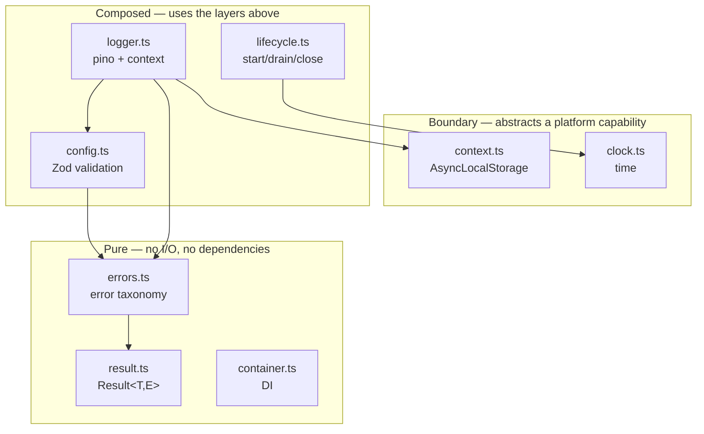
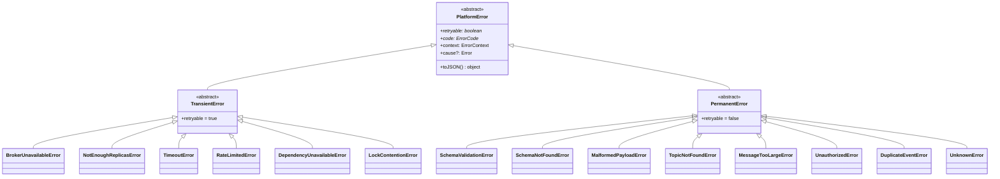
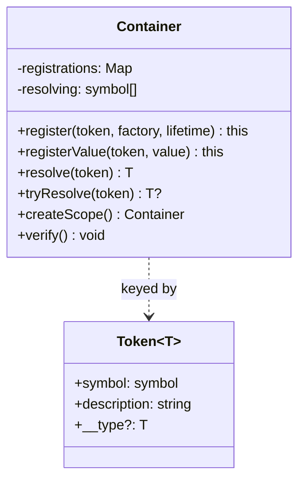
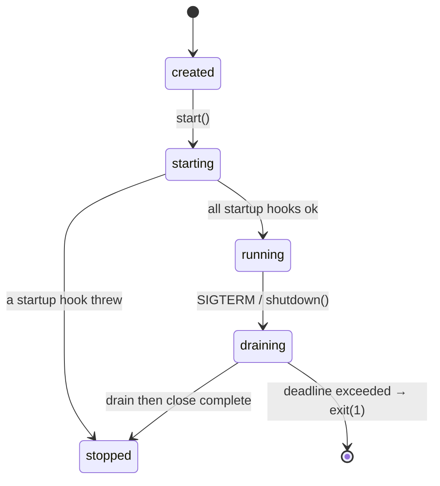

# `@platform/core` — Low-Level Design

> **Status:** Chapter 2 · Companion to [ADR-0009](../adr/0009-hand-rolled-di-container.md)

Cross-cutting primitives every service depends on. Nothing here knows about
Kafka, HTTP or Postgres — that separation is what lets the domain be tested with
no infrastructure at all.

---

## 1. Module map



The dependency direction is strictly downward. `result.ts` imports nothing;
`errors.ts` imports nothing. That matters because the retry engine's central
decision — retryable or not — must be evaluable without loading a logger, a
config or a clock.

---

## 2. Error taxonomy



**Why `retryable` is abstract rather than a constructor argument.** A constructor
argument lets two throw sites of the same error class disagree. As an abstract
member, each subclass takes the position once and it is visible in the type. A
test asserts exactly this.

**Why the default is permanent.** Retrying an unknown error amplifies load during
an incident and is invisible — retries look like normal traffic. A DLQ entry is
loud: it alerts, and a human looks at it. Failing loudly beats degrading quietly.

### The decision this drives

```
handler throws
      │
      ▼
isRetryable(error)?
      │
  ┌───┴────┐
 yes       no
  │         │
  ▼         ▼
retry     dlq.<domain>
tier      (+ alert)
```

That single branch is why this file exists and why it has the most tests.

---

## 3. Container



`__type` is a phantom field — it never exists at runtime. Its only job is to make
`Token<Database>` and `Token<Cache>` incompatible at compile time, so a mis-wired
container fails to build rather than failing at 3am.

Full rationale, including why not InversifyJS: [ADR-0009](../adr/0009-hand-rolled-di-container.md).

---

## 4. Lifecycle

The two-phase shutdown is the part most worth understanding.



```
SIGTERM
   │
   ├─ PHASE 1: DRAIN  (concurrent)
   │     close HTTP listener · pause consumer
   │     in-flight work continues
   │
   ├─ PHASE 2: CLOSE  (sequential, REVERSE registration order)
   │     flush producer → commit offsets → close pools
   │
   └─ global deadline 25s → log the culprit, exit(1)
```

**Reverse order, because registration order is dependency order.** Registering
`database` then `httpServer` means the server depends on the database, so the
server must close first — otherwise in-flight requests hit a closed pool and
return 500s during what should be a clean drain.

**Two phases, because one phase loses data.** A single "close everything" step
aborts in-flight work, which is the loss the drain exists to prevent.

**25s, because Kubernetes' default `terminationGracePeriodSeconds` is 30.** Any
higher and SIGKILL lands mid-shutdown, voiding every guarantee above.

### Failure behaviour

| Failure                 | Response                           | Why                                                                   |
| ----------------------- | ---------------------------------- | --------------------------------------------------------------------- |
| One hook throws         | Log the hook name, continue        | Otherwise an unrelated cache failure leaves the producer unflushed    |
| One hook hangs          | Per-hook 10s timeout, then move on | Bounds the blast radius; without it one hook eats the whole budget    |
| Whole shutdown overruns | Log and `exit(1)`                  | A deliberate exit is attributable; being SIGKILLed leaves no evidence |
| Second SIGTERM arrives  | Ignore, log a hint                 | Aborting a legitimate drain causes exactly the data loss it prevents  |
| Unhandled rejection     | Shut down, `exit(1)`               | Process state is unknown; continuing risks acting on corrupt state    |

---

## 5. Context propagation

```
runWithContext({ correlationId: 'abc' }, async () => {
    ├─ await kafka.publish()      ← sees 'abc'
    ├─ setTimeout(...)            ← sees 'abc'
    └─ .then(() => log.info())    ← sees 'abc', automatically
})
```

AsyncLocalStorage follows the _async execution chain_, not the call stack. Two
concurrent requests each get their own store with no interference — which a
module-level variable cannot do, because Node interleaves them on one thread.

**It does not cross process boundaries.** Propagating over Kafka is a separate
mechanism (headers), implemented in the producer and consumer. This module only
guarantees continuity within one process.

---

## 6. Time

Two clocks, because confusing them causes real bugs.

|                  | `now()`                                              | `monotonic()`                   |
| ---------------- | ---------------------------------------------------- | ------------------------------- |
| Unit             | ms since epoch                                       | ns from an arbitrary origin     |
| Can go backwards | **Yes** — NTP, VM migration, operator                | Never                           |
| Use for          | Event timestamps, TTL deadlines that survive restart | Elapsed time, latency, timeouts |

Measuring a duration with `now()` is the classic mistake: an NTP step mid-measurement
yields a negative latency that poisons a histogram, or makes a timeout appear not
to have elapsed so a request hangs until the next correction. `FixedClock.setTime()`
exists specifically to reproduce this in a test.

---

## 7. Configuration

Parse, don't validate. `loadConfig()` runs once at startup and returns a frozen,
fully-typed object; nothing else in the codebase touches `process.env`.

**Why hand-written numeric transforms instead of `z.coerce.number()`:** coercion
accepts `''` as `0` and `'abc'` as `NaN`. A pool size of 0 and a timeout of NaN
are both catastrophic and both look like valid numbers downstream — every NaN
comparison is false, so a misconfigured timeout silently becomes "never time
out". Tests assert both rejections.

**Defaults only where a wrong value is harmless.** `KAFKA_BROKERS`,
`POSTGRES_HOST`, `POSTGRES_PASSWORD` and `REDIS_HOST` are required, so the
process refuses to start rather than silently connecting to a development
default — a well-worn path to production incidents.

---

## 8. Testing seams this package provides

| Seam                          | Replaces              | Makes testable                             |
| ----------------------------- | --------------------- | ------------------------------------------ |
| `Clock` → `FixedClock`        | Wall-clock and sleeps | An hour of retry backoff, synchronously    |
| `Logger` → `RecordingLogger`  | Log output            | "the DLQ path logged the reason"           |
| `Container.register` override | Any dependency        | Production graph with two fakes            |
| `loadConfig(env)`             | `process.env`         | Config validation without mutating globals |

That list is the practical payoff of the whole package: every downstream chapter
gets deterministic tests for free.

---

## 9. What this package deliberately does not do

- **No async factories in the container** — connection setup belongs to the
  lifecycle manager. Mixing them is how containers become frameworks.
- **No retry/backoff helpers** — those belong with the retry engine (Chapter 9),
  where the tier topology lives.
- **No metrics** — Chapter 12. Adding a metrics dependency here would make the
  pure modules impure.
- **No `no-restricted-globals` rule against `Date.now()`** yet. The convention is
  documented; enforcing it in ESLint is worth doing once there is enough
  time-dependent code to protect.
