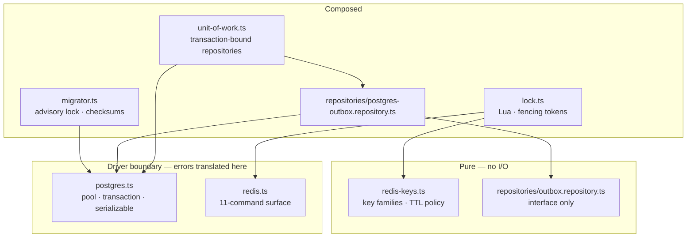
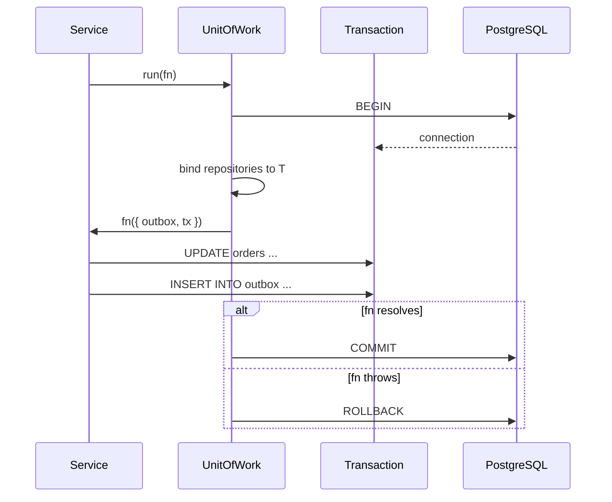
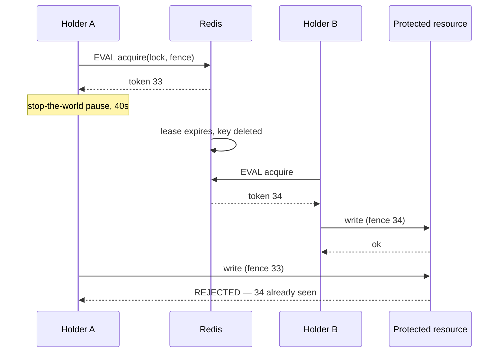

# `@platform/persistence` — Low-Level Design

> **Status:** Chapter 3 · Companions: [ADR-0010](../adr/0010-repository-over-orm.md) (repositories over an ORM), [ADR-0011](../adr/0011-fencing-tokens-over-redlock.md) (fencing tokens over Redlock)

Everything that touches PostgreSQL or Redis. Nothing above this layer imports
`pg` or `ioredis` — that is the property the whole package exists to hold.

---

## 1. Module map



Two boundaries, two translators. `translatePostgresError` and
`translateRedisError` are the only places driver error shapes exist; above
them everything is `PlatformError` and the retryable/permanent decision is
already made.

---

## 2. Two guarantees, and which mechanism provides each

The chapter is built around one distinction that gets blurred constantly:

| Guarantee                                        | Mechanism                            | What happens if it fails                         |
| ------------------------------------------------ | ------------------------------------ | ------------------------------------------------ |
| Event and state change commit together           | **Unit of Work** (one transaction)   | Event published for a change that never happened |
| N relays drain one table without duplicating     | **`FOR UPDATE SKIP LOCKED`**         | Every event published N times                    |
| Events for one aggregate publish in order        | **Relay sharding on `aggregate_id`** | `order.updated` overtakes `order.created`        |
| One holder in a critical section (usually)       | **Redis `SET NX`** — _efficiency_    | Redundant work; no corruption on its own         |
| A superseded holder cannot overwrite a newer one | **Fencing token** — _correctness_    | Silent state corruption                          |
| Concurrent pods do not race on migrations        | **Postgres advisory lock**           | Half-applied schema, crash-looping pods          |
| An applied migration is never silently edited    | **SHA-256 checksums**                | Environments diverge, nothing reports it         |

The rows in italics-adjacent pairs matter most: `SET NX` and the fencing token
look like one feature and are two, with completely different strengths.
ADR-0011 is the long form.

---

## 3. Unit of Work — the mistake it makes unwritable



The failure this prevents is not exotic. A repository injected as a singleton
holds the **pool**; calling it inside a transaction borrows a _different_
connection, which commits on its own. The code reads as transactional, compiles,
and passes any test that asserts "the row was written". It fails only when the
outer transaction rolls back — and then an event exists describing a state
change that does not.

The design response is to make the wrong call unwritable rather than to
document it: repositories are constructed per transaction and handed to the
callback, so there is no repository object in scope outside one.

`uow.repositories` exists for reads outside a transaction, and is a getter that
builds a fresh graph on each access — a cached one would be exactly the
long-lived pool-bound object the design removed.

---

## 4. The outbox relay

```
┌──────────────────────────────────────────────────────────────┐
│ TRANSACTION (application)                                    │
│   UPDATE orders SET status = 'placed' WHERE id = 42          │
│   INSERT INTO outbox (...) VALUES (...)                      │
│ COMMIT  ← both or neither                                    │
└──────────────────────────────────────────────────────────────┘
                              │
                              ▼
┌──────────────────────────────────────────────────────────────┐
│ TRANSACTION (relay, every N ms)                              │
│   SELECT ... WHERE published_at IS NULL                      │
│     ORDER BY id LIMIT 500 FOR UPDATE SKIP LOCKED             │
│   → publish to Kafka                                         │
│   UPDATE outbox SET published_at = now(), ... (unnest)       │
│ COMMIT                                                        │
└──────────────────────────────────────────────────────────────┘
```

**Why the claim must be inside a transaction.** `SKIP LOCKED` works through row
locks, and row locks last exactly as long as the transaction. Claim outside one
and the locks are released immediately — every relay claims the same rows and
every event publishes N times.

**Why `ORDER BY id` before `LIMIT` before `SKIP LOCKED`.** Postgres applies
`SKIP LOCKED` during the scan, so `LIMIT` counts _unlocked_ rows. A batch is
therefore full even when another relay holds the first hundred. The integration
suite asserts exactly this, because it is the difference between a relay that
scales and one that returns empty batches under load.

**Why publish-then-mark, not mark-then-publish.** A crash between publish and
mark republishes on the next tick — a duplicate, which consumers already
deduplicate (ADR-0008). A crash between mark and publish loses the event
permanently. At-least-once is a choice, and this is where it is made.

### Ordering under N relays

`SKIP LOCKED` costs global ordering: relay 2 can publish id 250 before relay 1
publishes id 150. For unrelated events that is irrelevant — Kafka only orders
within a partition. For two events about the same aggregate it is a bug, because
they share a partition key and therefore a partition.

```
hashtext(aggregate_id) & 0x7fffffff  %  total  =  index
```

Every event for one aggregate lands in one shard, so one relay publishes them in
`id` order. Ordering is preserved where it matters and nowhere else.

The mask is not cosmetic: `hashtext` returns a **signed** int4 and Postgres'
`%` keeps the sign, so an unmasked predicate matches no shard for roughly half
of all aggregate ids — a relay that starts cleanly and claims nothing.

> **Operational note.** Changing `total` while events are in flight can move an
> aggregate between shards and reorder its events. Drain the outbox before
> rescaling.

---

## 5. Locking — the two halves



The lock did not prevent A from running. Nothing built on leases can, because
the pause is unbounded and no TTL exceeds it. The **resource** prevented the
damage, by comparing a number.

That is why `Lease.token` is not optional in the type: a caller that ignores it
has an efficiency lock, and that should be a visible decision.

### Where the guard lives

In production, the check and the write must be the same statement:

```sql
UPDATE replay_jobs
   SET status = $1, fence_token = $2
 WHERE id = $3
   AND fence_token < $2
```

One statement, so they cannot be separated, and the comparison happens under
the row lock the `UPDATE` already takes. `InMemoryFencingGuard` is for tests and
process-local resources only; the persistent guard arrives in Chapter 10 with
the replay coordinator, the first shared resource that needs one.

### Why every script is Lua

Redis is single-threaded and does not interleave a script with another client's
commands. That is the only reason check-then-act is safe:

| Operation | Naive                 | Why it breaks                                                     |
| --------- | --------------------- | ----------------------------------------------------------------- |
| Acquire   | `SETNX` then `EXPIRE` | Crash between them → a lock with no TTL, held forever             |
| Release   | `DEL`                 | After a lease expiry, deletes **someone else's** lock → a cascade |
| Extend    | `PEXPIRE`             | Extends a lock you no longer hold, handing away the current lease |

---

## 6. Migrations

```
pod 1 ─┐
pod 2 ─┼─► pg_advisory_lock(8472910364155)  ─►  one runner proceeds
pod 3 ─┘                                        others block, then find
                                                the work already done
```

Session-level, not `pg_advisory_xact_lock`: the lock must span multiple
transactions because each migration commits separately. Released explicitly in
`finally`, because a session lock on a **pooled** connection outlives the
function and a leak blocks every future run until that connection is recycled —
an outage that starts on the next deploy, not this one.

Each migration's DDL and its bookkeeping row commit **together**, which works
only because Postgres has transactional DDL. Without it, a crash between them
leaves a migration applied but unrecorded, and the next run reapplies it.

Checksums turn "someone fixed a typo in an applied migration" from silent
environment divergence into a named startup failure. There are no down
migrations — a rollback that drops a column destroys everything written since
the deploy, and nobody runs them under incident pressure anyway. Forward fixes,
expand/contract.

---

## 7. Redis: what it is trusted with

Only **derived or reconstructible** state — dedup marks, locks, rate-limit
buckets, caches, offset snapshots. Nothing here is a source of truth, because
`appendfsync everysec` loses up to a second of writes on a hard failure and a
failover to a replica can lose more.

That constraint is what makes the idempotency design honest: losing a dedup mark
causes a **duplicate delivery**, which the platform already tolerates. If Redis
held anything whose loss were unrecoverable, it would be the wrong store.

The client exposes eleven commands. `KEYS`, `FLUSHDB` and friends are absent by
construction — `KEYS` is O(n) over the entire keyspace on a single-threaded
server, which on a production instance is an outage rather than a slow query.

### Key families and TTLs

| Family   | TTL  | Why that number                                                                |
| -------- | ---- | ------------------------------------------------------------------------------ |
| `idem`   | 24h  | Must exceed the longest replay window, or a replay re-executes its effects     |
| `lock`   | 30s  | Longer than a normal critical section; short enough that a killed pod unblocks |
| `fence`  | 1h   | Must outlive any lock — a counter reset revalidates stale tokens               |
| `rate`   | 120s | 2× the largest window, so a bucket is never evicted mid-window                 |
| `cache`  | 5m   | Schema IDs are immutable; subject→latest mapping is not                        |
| `offset` | 60s  | Dashboard freshness only; Kafka holds the authoritative offsets                |

Every family has a TTL. A key without one is a permanent leak that `allkeys-lru`
only notices at `maxmemory`, by which point it is evicting things still needed.

---

## 8. Error translation

`SQLSTATE` codes rather than message matching — they are part of the Postgres
contract and do not change wording between releases.

| Code / signal       | Maps to                      | Retryable | Reasoning                                                     |
| ------------------- | ---------------------------- | --------- | ------------------------------------------------------------- |
| `40001`, `40P01`    | `LockContentionError`        | yes       | Serialisation failure / deadlock; retry is the prescribed fix |
| `53xxx`, `57P0x`    | `DependencyUnavailableError` | yes       | Over capacity or failover in progress                         |
| `57014`             | `TimeoutError`               | yes       | Statement cancelled; safe only because writes carry keys      |
| `23505`             | `DuplicateEventError`        | no        | The row is already there; retrying cannot help                |
| `23502/23503/23514` | `UnknownError` (integrity)   | no        | Bad data                                                      |
| `ECONNREFUSED` etc. | `DependencyUnavailableError` | yes       | Never reached the server                                      |

**The Redis asymmetry worth knowing.** A timed-out Postgres statement inside a
transaction is rolled back, so the effect is known: nothing happened. Redis has
no rollback — a timed-out command may well have executed. `TimeoutError` is
still classified retryable, but only because **every Redis write here is
idempotent by construction** (`SET NX`, `INCR` on a gap-tolerant counter, an
identical dedup mark). That classification is a consequence of the data design,
not a property of Redis, and it stops being true the moment a non-idempotent
command joins the client surface.

---

## 9. Testing seams

| What                                                      | Where                        | Why there                                   |
| --------------------------------------------------------- | ---------------------------- | ------------------------------------------- |
| Generated SQL, guards, mapping                            | Unit (`*.test.ts`)           | Milliseconds; runs on save                  |
| `SKIP LOCKED`, transactional DDL, `SET NX`, Lua atomicity | Integration (Testcontainers) | Properties of the database, not of our code |

The split has one rule: **if a fake could make it pass, it belongs in the unit
suite.** A mock that returns what we expect proves the mock agrees with us; it
cannot fail when the assumption is wrong, which is the only time a test earns
its keep. This is the same stance `migrator.test.ts` took in Chapter 3 Part 1 —
mocking a lock proves nothing about whether the lock works.

`TransactionRunner` exists so a unit test can supply a two-method fake instead
of a real pool. Depending on the concrete `Postgres` class there would have
reintroduced, one layer up, exactly the coupling ADR-0010 rejected an ORM to
avoid.

---

## 10. Known limits

| Limit                                | Bites at                                              | Then what                                                                   |
| ------------------------------------ | ----------------------------------------------------- | --------------------------------------------------------------------------- |
| `POSTGRES_POOL_MAX=20` × replicas    | ~15 replicas vs `max_connections`                     | PgBouncer in transaction mode (costs session state: no advisory locks)      |
| `countUnpublished` scans the backlog | A large backlog — i.e. exactly when it is polled most | Derive lag from `max(id) - max(published id)`                               |
| Redis single node                    | Node loss drops every lock at once                    | Persist fencing counters for resources that cannot tolerate a reset         |
| Relay sharding fixed at deploy       | Rescaling mid-backlog                                 | Drain before rescaling                                                      |
| Idempotency memory at 24h × 10K/sec  | ~110 GB — beyond one node                             | Lower the TTL, hash the key, or shard Redis (arithmetic in `redis-keys.ts`) |
