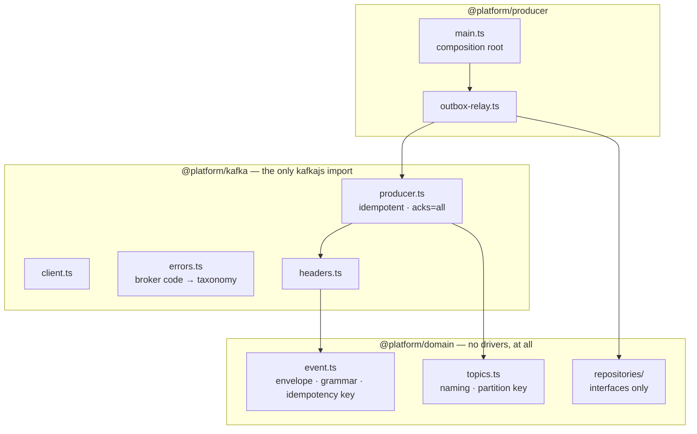

# Producer path — Low-Level Design

> **Status:** Chapter 4 · Companions: [ADR-0012](../adr/0012-event-envelope-and-versioning.md) (envelope), [ADR-0013](../adr/0013-idempotent-producer-settings.md) (producer settings), [ADR-0007](../adr/0007-transactional-outbox.md) (outbox)

From a business transaction to a Kafka record, and everything that can go
wrong between the two.

---

## 1. Layering



The arrows all point **inwards**. `@platform/domain` imports nothing but
`@platform/core`, which is why the retry engine, DLQ and replay service can be
written against envelopes and tested with no containers.

---

## 2. The publish path

```
┌── application transaction ──────────────────────────────┐
│  UPDATE orders SET status = 'placed' WHERE id = 42      │
│  INSERT INTO outbox (...)                               │
│  COMMIT   ← both, or neither                            │
└─────────────────────────────────────────────────────────┘
                          │  (relay tick, every ≤200 ms)
┌── relay transaction ────┴───────────────────────────────┐
│  SELECT ... FOR UPDATE SKIP LOCKED                      │
│  kafka.publishBatch()        ← inside. See §3.          │
│  UPDATE outbox SET published_at = now()                 │
│  COMMIT                                                  │
└─────────────────────────────────────────────────────────┘
```

Latency budget: an event is durable at the first COMMIT and visible to
consumers within roughly `idleDelayMs + publish latency` — about 215 ms at the
defaults. That is the number to quote when someone asks "how real-time is it";
lowering `idleDelayMs` trades database load for it.

---

## 3. Why the publish is inside the transaction

Keeping I/O out of a transaction is normally right. Here it is wrong, and the
reason is that **the row lock is the claim**.

| Ordering                        | Failure                                                                                |
| ------------------------------- | -------------------------------------------------------------------------------------- |
| claim → commit → publish        | Rows unlock while unpublished; a second relay claims and republishes them              |
| claim → publish → mark → commit | A crash before COMMIT republishes next tick — a duplicate, which consumers deduplicate |
| claim → mark → commit → publish | A crash after COMMIT loses the event permanently, with nothing left to detect it       |

The middle row is the design. At-least-once is chosen here, in this ordering,
and nowhere else in the platform.

**The accepted cost:** a batch holds its rows for the publish latency (~15 ms
at `acks=all`). `statement_timeout` and `idle_in_transaction_session_timeout`
bound the damage if the broker hangs. Batch size is therefore a pool-pressure
decision as much as a throughput one.

---

## 4. Scaling the relay

```
hashtext(aggregate_id) & 0x7fffffff  %  total  =  shard index
```

Not leader election. A single elected relay is a throughput ceiling _and_ a
failover gap; `SKIP LOCKED` already lets N relays drain one table without
duplicating. Sharding on `aggregate_id` is what preserves the ordering
`SKIP LOCKED` would otherwise cost — every event for one aggregate is claimed
by one relay and published in `id` order.

Shard identity comes from the pod ordinal, which is why the relay runs as a
StatefulSet despite holding no state.

> **Rescaling requires a drain.** Changing `total` mid-backlog moves an
> aggregate between shards and can reorder its events.

---

## 5. Producer settings and what each prevents

| Setting                  | Value       | Prevents                                                       |
| ------------------------ | ----------- | -------------------------------------------------------------- |
| `acks`                   | `-1`        | An acknowledged write existing on only the leader when it dies |
| `enable.idempotence`     | `true`      | A retried batch duplicating after an ambiguous timeout         |
| `max.in.flight`          | `5`         | Reordering on retry — safe only _because_ of idempotence       |
| `allowAutoTopicCreation` | `false`     | A critical topic created with replication factor 1             |
| `retries`                | 5, jittered | A synchronised retry wave against a recovering broker          |

The first three are one decision. Turning idempotence off silently converts
every produce timeout into a duplicate **and** makes five in-flight requests a
reordering bug — while `errors.ts` still classifies timeouts as retryable.

---

## 6. Failure modes

| Failure                    | Behaviour                                                        | Why                                                                         |
| -------------------------- | ---------------------------------------------------------------- | --------------------------------------------------------------------------- |
| Broker unavailable         | Transaction rolls back, rows stay claimable, backoff with jitter | Retryable; the backlog grows and the lag alert fires                        |
| `MESSAGE_TOO_LARGE`        | Permanent, batch rolls back                                      | Retrying reproduces it forever and blocks the partition                     |
| Unknown topic              | Permanent                                                        | Auto-creation is off, so it is a skipped provisioning step — a deploy bug   |
| `OutOfOrderSequenceNumber` | Fatal, producer must be recreated                                | Producer and broker sequence state diverged; retry spins forever            |
| Batch spans partitions     | Published; location recorded as unknown                          | One RecordMetadata per partition, and nothing says which message went where |
| Relay pod killed mid-tick  | Transaction aborts, rows unlock, another relay claims them       | The claim never outlives the transaction                                    |
| Persistent failure         | Severity escalates after 5 consecutive failures                  | A broker restart is a burst of retryable errors and should not page anyone  |

---

## 7. Known limits

| Limit                                  | Bites at                                | Then what                                                         |
| -------------------------------------- | --------------------------------------- | ----------------------------------------------------------------- |
| Polling at `idleDelayMs`               | Latency floor ~200 ms                   | Postgres `LISTEN/NOTIFY` on outbox insert                         |
| Batch holds rows across a network call | Slow broker × large batch × many relays | Lower batch size; the pool is the constraint before throughput is |
| gzip compression                       | Produce-side CPU                        | Register `kafkajs-lz4` and amend ADR-0013                         |
| One `send` per topic per tick          | Many topics, small batches              | Acceptable: `sendBatch` cannot attribute per-topic failures       |
| Envelope in headers                    | ~250–400 bytes/message                  | Batch small events into meaningful ones                           |
